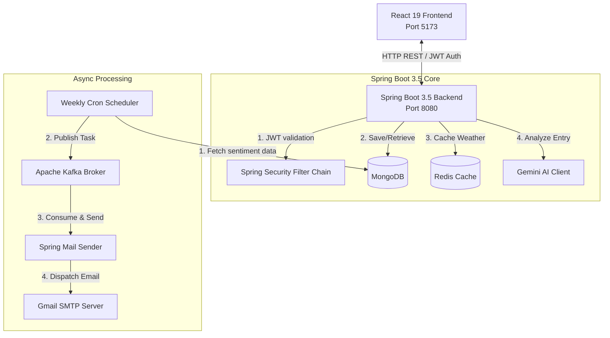

# 📓 AI-Powered Journaling Platform

> A full-stack, enterprise-grade journaling web application featuring real-time AI sentiment analysis, weekly mood tracking, automated weather logs, high-performance caching, and asynchronous messaging pipelines.

<p align="left">
  
  
  
  
</p>

<p align="left">
  
  
  
  
  
</p>

---

## 🏗 System Architecture

The following diagram illustrates how the components, data stores, and asynchronous background pipelines interact:



---

## 🌟 Features

* **🔐 Advanced Authentication:** Fully secured REST endpoints utilizing stateless JSON Web Tokens (JWT) and Google OAuth2 integration.
* **🧠 AI Sentiment Analysis:** Auto-detects sentiment (Positive, Neutral, Negative) of journal entries using Google Gemini 2.0 Flash API, with an inline keyword-based backup parser in case of network outages.
* **🌦 Weather Integration:** Dynamically appends weather details (temperature, condition) to journal entries, with high-performance caching via Redis to eliminate external API rate limits.
* **📬 Async Weekly Reports:** A background scheduler compiles user sentiments weekly, schedules execution via Apache Kafka queues, and sends emails automatically via Spring Mail.
* **🎨 Modern Responsive UI:** A light/dark theme design built using Tailwind CSS 4, Framer Motion transitions, and a glassmorphism theme.
* **👥 Admin Controls:** Secure endpoints for data maintenance, user overview logs, and system controls.

---

## ⚙️ Configuration & Environment

The backend reads settings from environment variables. Copy the config parameters to your `.env` file in the root `journalApp-master/` folder:

```env
# Server
SERVER_PORT=8080

# JWT
JWT_SECRET=your-256-bit-cryptographic-signing-key

# MongoDB & Redis
MONGODB_URI=mongodb://localhost:27017/journaldb
REDIS_HOST=localhost
REDIS_PASSWORD=your_redis_password

# Apache Kafka
KAFKA_SERVERS=localhost:9092
KAFKA_API_KEY=your_kafka_api_key
KAFKA_API_SECRET=your_kafka_api_secret

# AI Models (Google Gemini)
GEMINI_API_KEY=your_gemini_api_key

# Third-Party Integrations
WEATHER_API_KEY=your_weather_api_key
GOOGLE_CLIENT_ID=your_google_oauth2_client_id
GOOGLE_CLIENT_SECRET=your_google_oauth2_client_secret

# Email Service (SMTP)
JAVA_EMAIL=your_email@gmail.com
JAVA_EMAIL_PASSWORD=your_app_specific_password
```

---

## 🚀 Quick Start

### Prerequisites
* **JDK 25** & **Node.js 20+**
* Running instances of **MongoDB**, **Redis**, and **Apache Kafka**

### 1. Run the Backend
```bash
cd journalApp-master
./mvnw spring-boot:run
```
The server will run on **`http://localhost:8080`**.

### 2. Run the Frontend
```bash
cd journal-ui
npm install
npm run dev
```
The web client will compile and become available at **`http://localhost:5173`**.

---

## 📖 API Documentation

The backend automatically exposes interactive API docs via OpenAPI 3. Once the server is running, navigate to:

👉 **[http://localhost:8080/swagger-ui/index.html](http://localhost:8080/swagger-ui/index.html)**

---

## 🧪 Testing Suite

Tests are built using **JUnit 5** and **Mockito** to verify application correctness:
```bash
cd journalApp-master
./mvnw test
```

* **Unit Tests:** Located under `src/test/` to test services in isolation by mocking databases (`@Mock`, `@InjectMocks`).
* **Integration Tests:** Disabled by default (`@Disabled`), useful for manual database verification.

---

## 🔐 Security Notes

* The sensitive API keys, Mongo credentials, and JWT signing keys are stored in a `.env` file and loaded via `spring-dotenv`.
* The `.env` file is listed in `.gitignore` — **it will never be committed to source control**.
* CORS is configured to only permit communication from trusted origins (defaulting to the local React server: `http://localhost:5173`).

---

## 👤 Author

Built with ❤️ by **Jasneet Singh**.

| ⭐️ If this project helped you, consider giving it a star on GitHub! |
|---|

---

## 📄 License

This project is open-source and available under the [MIT License](LICENSE).
